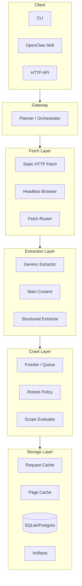
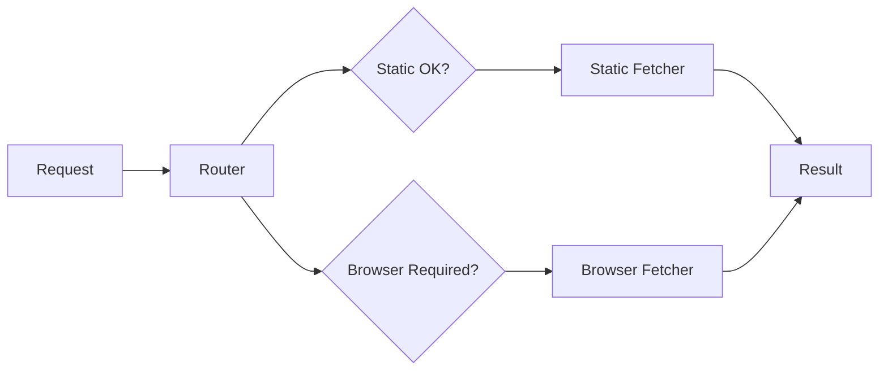
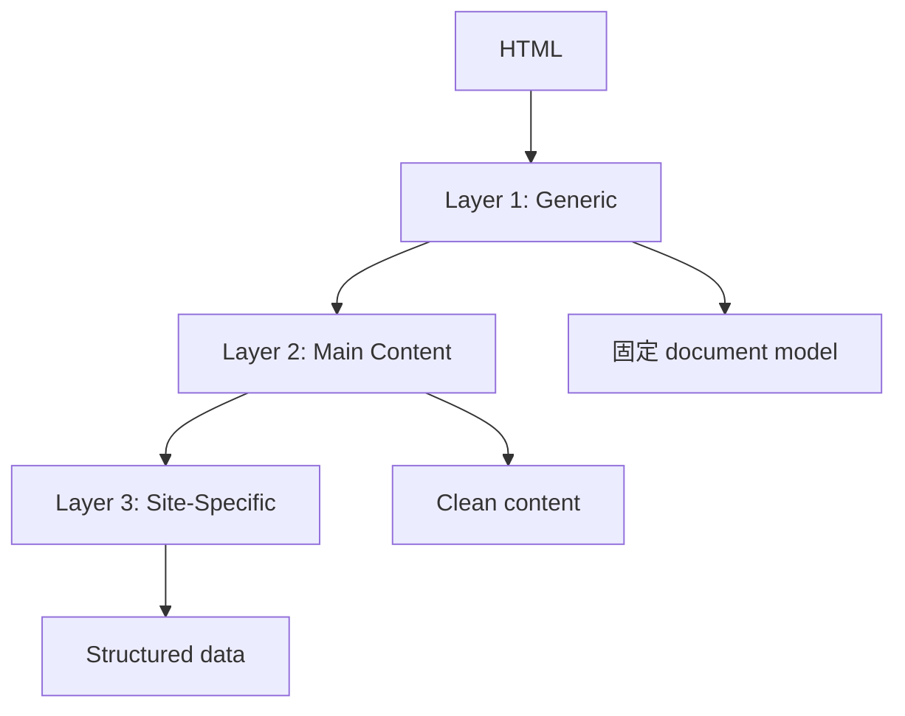

# OpenClaw Web Intelligence Gateway — Architecture

> 本文件詳細描述系統的分層架構與各模組職責。

---

## 1. 系統架構總覽



---

## 2. 分層說明

### 2.1 Client Layer（客戶端）

| 介面 | 說明 |
|------|------|
| **CLI** | 命令列工具，支援 extract/search/map/crawl |
| **OpenClaw Skill** | OpenClaw 技能包裝，可被 Agent 調用 |
| **HTTP API** | RESTful API（future） |

### 2.2 Planner / Orchestrator（規劃層）

負責協調各層工作：
- 接收請求
- 決定使用哪個 fetch 策略
- 調度 extraction 流程
- 管理 crawl 狀態

### 2.3 Fetch Layer（獲取層）



#### Static Fetcher
- 使用 Node.js `fetch` API
- 支援自訂 headers、timeout、retry
- 適合靜態頁面

#### Browser Fetcher
- 使用 Playwright（`browserFetcher.ts` 第一版已落地）
- 支援 JS rendering
- 可設定 UA、viewport、timezone
- 支援 screenshot（debug 用）
- 若套件或 browser binaries 不可用，回傳 `BROWSER_UNAVAILABLE`，由 router/fallback flow 接手

#### Fetch Router
根據以下條件決策：
1. 使用者明確指定 `renderMode=browser`
2. Static fetch 後文字量太少
3. HTML 裡 framework 特徵明顯（React/Vue/Angular）
4. Title/canonical/body 空洞
5. Domain 在 browser-required 清單

目前第一版 auto-detection 已落地：
- `auto` 模式先走 static
- extract / crawl 若偵測到 JS app shell / low confidence / thin static content，會自動 browser retry
- response 會保留 fetch decision metadata 方便 debug

另外已補上 cache revalidation 實作：
- static page cache 命中時，會用 `If-None-Match` / `If-Modified-Since` 做 conditional revalidation
- 304 時沿用 cached snapshot；200 時刷新 page cache 與後續抽取內容

### 2.4 Extraction Layer（擷取層）

#### 三層設計



**Layer 1: 通用內容**
- 輸出固定 document model
- Title、description、canonical、language
- Main text、markdown、links

**Layer 2: 主內容辨識**
- article/main/role=main 優先
- Boilerplate removal
- Nav/footer/sidebar 剔除
- Heading tree 保留

**Layer 3: 站型專用**
- Pluggable extractor
- 目前 v1 已支援：docs、article、product、forum
- generic 仍保留為 fallback document model

#### Structured Output Schema
```typescript
type StructuredDocument = {
  kind: "generic" | "article" | "docs" | "product" | "forum";
  fields: Record<string, unknown>;
  confidence: number;
}
```

### 2.5 Crawl Layer（爬蟲層）

#### 元件

| 元件 | 說明 |
|------|------|
| **Frontier** | URL 排程與狀態管理 |
| **Queue** | 待抓取 URL 佇列 |
| **Robots Policy** | robots.txt 解析與檢查 |
| **Scope Evaluator** | 網域/路徑過濾 |
| **Dedupe** | URL 去重 |

#### 運作流程
```
1. 從 seed URL 開始
2. Frontier enqueue 前檢查 robots
3. Scope evaluator 判斷是否在範圍內
4. Queue 调度（per-domain concurrency control）
5. Fetch → Extract → Discover new URLs
6. 重複直到達到 limit/depth
```

### 2.6 Storage Layer（儲存層）

#### 雙層快取架構

| 層 | 說明 |
|----|------|
| **Request Cache** | 搜尋/擷取結果快取，基於 request hash |
| **Page Cache** | 原始頁面快取，基於 URL + ETag/Last-Modified |

#### 支援功能
- TTL（Time-To-Live）過期
- Stale-while-revalidate
- Per-URL 自訂 TTL

#### 儲存元件
- **SQLite/Postgres**: 結構化資料（jobs、pages、policies）
- **Artifacts**: 原始 HTML、screenshots、logs

---

## 3. 資料模型

### 3.1 PageFetchResult
```typescript
interface PageFetchResult {
  url: string;
  finalUrl: string;
  statusCode: number;
  headers: Record<string, string>;
  contentType?: string;
  html?: string;
  screenshotPath?: string;
  fetchedAt: string;
  via: "static" | "browser";
  proxyId?: string;
}
```

### 3.2 ExtractedDocument
```typescript
interface ExtractedDocument {
  url: string;
  kind: "generic" | "article" | "docs" | "product" | "forum";
  title?: string;
  text: string;
  markdown?: string;
  metadata: DocumentMetadata;
  structured?: StructuredData;
  links: string[];
  confidence: number;
  sourceQuality: number;
}
```

### 3.3 CrawlJob
```typescript
interface CrawlJob {
  jobId: string;
  seedUrl: string;
  status: "queued" | "running" | "done" | "failed";
  limits: CrawlLimits;
  summary: CrawlSummary;
  createdAt: string;
  completedAt?: string;
}
```

---

## 4. 錯誤處理

### 錯誤碼分類

| 類別 | 錯誤碼 | 說明 |
|------|--------|------|
| 驗證 | `VALIDATION_ERROR` | 參數驗證失敗 |
| 政策 | `DOMAIN_POLICY_DENIED` | 網域被拒絕 |
| 政策 | `ROBOTS_POLICY_DENIED` | robots.txt 禁止 |
| 網路 | `FETCH_TIMEOUT` | 請求超時 |
| 網路 | `FETCH_HTTP_ERROR` | HTTP 錯誤 |
| 解析 | `PARSE_ERROR` | HTML 解析失敗 |
| 搜尋 | `SEARCH_ERROR` | 搜尋引擎錯誤 |
| 內部 | `INTERNAL_ERROR` | 內部錯誤 |

---

## 5. 安全機制

### robotsMode 策略

| 模式 | 行為 |
|------|------|
| **strict** | 不允許就不抓 |
| **lenient** | 記 warning，但可抓 |
| **off** | 完全忽略 |

### Per-Domain 控制
- 全域並發限制
- 每網域並發限制
- 每網域速率限制
- 重試預算

---

## 6. 目錄結構

```
src/
├── api/                      # API 介面
│   ├── cli/                  # CLI 入口
│   └── skill/                # OpenClaw Skill
├── core/
│   ├── planner/              # 規劃器
│   └── models/               # 共用模型
├── fetch/
│   ├── static/               # 靜態獲取
│   ├── browser/               # Browser 獲取
│   └── router/               # 獲取路由
├── extract/
│   ├── generic/              # 通用擷取
│   ├── maincontent/          # 主內容辨識
│   └── site-specific/        # 站型專用
├── crawl/
│   ├── frontier/            # URL  frontier
│   ├── scheduler/           # 排程器
│   └── policies/            # robots/scope
├── storage/
│   ├── cache/               # 快取
│   ├── db/                  # 資料庫
│   └── artifacts/           # 檔案儲存
└── observability/            # 可觀測性
```

---

## 🔗 相關文件

- [ROADMAP.md](./ROADMAP.md) - 總體路線圖
- [README.md](./README.md) - 專案說明
- [API Spec](./docs/openclaw-web-intelligence-api-spec.md) - API 規格
