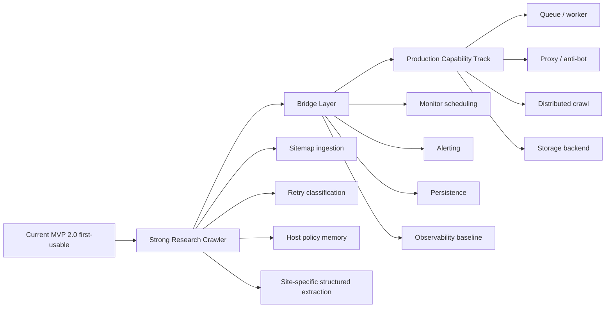

# OpenClaw Web Intelligence Gateway — Research to Production Plan

> 這份文件定義 `openclaw-web-intelligence` 如何從 **Agent-first research crawler**，演進為具備更強治理、可規模化、可持續運維的 **production crawler capability**。

---

## Executive Summary

目前 `openclaw-web-intelligence` 最適合的定位，不是直接衝大型 production crawler，而是先把它做成 **高品質 research crawler**。

原因很直接：
- 現在單機抓取能力已經有不錯基礎
- browser fallback、structured extraction、monitor baseline 都已落地第一版
- 但還欠 sitemap、host policy memory、site-specific structured extraction 這些會直接影響研究品質的核心能力

因此這份計畫書採兩段式演進：

1. **Phase A — Strong Research Crawler**
   - 目標：抓得更準、抓得更全、資料更 agent-ready
2. **Phase B — Production Capability Track**
   - 目標：可排程、可治理、可擴展、可分散執行

關鍵原則：
> **先把 research quality 做強，再啟動 production complexity。**

---

## 1. Current Positioning

### 當前定位
`openclaw-web-intelligence` 目前是一個：

- 給 OpenClaw / agent 使用的 web intelligence layer
- 以 research / docs / article / blog 分析為優先的 crawler
- 重視輸出品質而非吞吐量的 retrieval system

### 已具備能力
- Search（DDGS）
- Extract（static + browser fallback）
- Map / Crawl（BFS + robots + sitemap）
- Request/Page dual cache
- Conditional revalidation（ETag / Last-Modified）
- Structured extraction v1.1
- Monitor / Diff v1
- Sitemap ingestion v1
- Retry classification v1

### 目前尚未成熟的部分
- sitemap ingestion
- host policy memory
- retry classification
- richer site-specific structured extraction
- browser deployment / ops 文檔
- per-domain rate limiting
- scheduler / alerting / job persistence
- queue / worker / distributed execution
- proxy / anti-bot / storage backend

---

## 2. North Star

### Research Track North Star
> 讓 agent 能穩定、快速、低摩擦地從 docs/blog/article 站點取得高品質、可直接使用的內容與結構化資訊。

### Production Track North Star
> 讓 crawler 能在明確需求下，支援持續執行、排程、監控、治理與規模化運作，而不犧牲可觀測性與安全性。

---

## 3. Two-Track Evolution Model

---

## 4. Phase A — Strong Research Crawler

## Goal
把目前的系統做成 **強 research crawler**，優先處理：
- coverage
- routing quality
- extraction quality
- agent-ready structured output

## Workstreams

### A1. Sitemap ingestion
**Why**
- docs / blog / changelog 站點大量重要 URL 不一定能靠 BFS 完整發現
- sitemap 能顯著提高 coverage 與效率

**Deliverables**
- `sitemap.xml` 偵測
- sitemap index 支援
- XML URL parse + normalize + dedupe
- 與 map / crawl 整合
- respect scope / robots constraints

**Success signal**
- docs 站 discover coverage 顯著提升
- crawl 入口品質改善

---

### A2. Retry classification
**Why**
- 現有 heuristic 已能工作，但仍偏 generic
- 需要把 retry reasons 制度化，才能持續演進

**Deliverables**
- standardized retry reason taxonomy
- fetch outcome classification
- better fallback observability
- future host-policy input signals

**Success signal**
- 更容易判斷 browser retry 是否合理
- routing 誤判更容易被追蹤

---

### A3. Host policy memory
**Why**
- 不同 host 的 static/browser 適配規律很明顯
- 讓系統「記住」哪些 host 常常要 browser，比一直靠通用規則更穩

**Deliverables**
- per-host fetch outcome memory
- preferred strategy hints
- host-specific confidence adjustments
- retry history integration

**Success signal**
- 常見 docs/blog host 的抓取成功率上升
- 不必要 browser fetch 下降

---

### A4. Site-specific structured extraction
**Why**
- 對 agent 有價值的是 structured intelligence，不只是 text
- docs/article 先做出深度，比 production scalability 更值得

**Suggested targets**
- Docusaurus
- MkDocs / Material for MkDocs
- GitHub Docs-like
- common blog CMS
- changelog / release-note patterns

**Deliverables**
- richer extractor plugins
- schema normalization
- docs/article/changelog specific fields

**Success signal**
- output 更適合 compare / summarize / monitor
- agent downstream quality 明顯提升

---

### A5. Browser ops / deployment docs
**Why**
- browser fetch 已能運作，但部署與運維摩擦仍高

**Deliverables**
- Playwright installation guide
- Chromium binary requirements
- CI / Docker / WSL notes
- troubleshooting section

**Success signal**
- 其他環境能更穩定落地 browser fetch

---

### A6. Lightweight per-domain rate limiting
**Why**
- research crawler 也需要基本治理
- 這能提前降低 production 化時的風險

**Deliverables**
- basic per-domain pacing
- configurable concurrency/interval limits

**Success signal**
- crawl 行為更溫和
- 更少 accidental burst

---

## 5. Gate — When Research Track Is “Strong Enough”

只有當下面條件大致成立，才應該正式進入 production track：

### Gate A: Research Ready
- docs / article / blog 抓取穩定
- sitemap ingestion 已可用
- browser retry / routing 誤判率可接受
- structured extraction 對主要站型已有明顯價值
- browser ops 文檔完整
- monitor engine 維持穩定可測

### Gate B: Operational Pressure Exists
至少有一項真實壓力成立：
- 有 recurring crawl / monitor job 需求
- 有跨多 domain 的批量任務需求
- 有排隊 / worker orchestration 需求
- 有 anti-bot / rate limiting 真實瓶頸
- 單機單進程已成為效能瓶頸

> 若 Gate A 未達成，就不該過早投入重型 production 能力。

---

## 6. Bridge Layer — Research 到 Production 的中間層

這一層很重要，因為 production 不是直接從 sitemap 跳到 distributed queue。

## Goal
建立最小可治理能力，讓系統從 research engine 轉為可持續運行的 service。

### B1. Monitor scheduling
- recurring monitor execution
- schedule parsing / validation
- lightweight runner

### B2. Alerting
- console / webhook / Telegram notifier abstraction
- cooldown policy
- only-on-change semantics

### B3. Persistence baseline
- monitor job persistence
- snapshot history persistence
- future crawl job state groundwork

### B4. Observability baseline
- request metrics
- crawl metrics
- retry/fallback counters
- host-level fetch telemetry

### B5. Governance baseline
- per-domain rate controls
- safer concurrency defaults
- audit-friendly logs

---

## 7. Phase B — Production Capability Track

## Goal
在已確認有真實 operational pressure 後，開展 production crawler 能力。

## Workstreams

### P1. Queue / worker abstraction
- crawl job queue
- worker lifecycle
- retry & backoff orchestration
- concurrency control

### P2. Persistent job model
- crawl job status persistence
- resumable jobs
- job history / audit trail

### P3. Proxy strategy
- outbound proxy abstraction
- domain-specific proxy policy
- credential handling / secret separation

### P4. Anti-bot strategy
- detection response strategy
- fallback path policy
- browser escalation policy
- safe throttling behavior

### P5. Distributed crawl
- multi-worker support
- queue-backed scheduling
- shard / frontier coordination

### P6. Storage backend upgrade
- SQLite / Postgres / Redis split by need
- crawl artifacts persistence
- snapshot / diff storage
- metadata indexing

### P7. Production observability
- metrics dashboard
- alert thresholds
- failure categorization
- SLA-style health checks

---

## 8. Capability Map

| Capability | Research Priority | Bridge Priority | Production Priority |
|------------|-------------------|-----------------|---------------------|
| Search | ✅ | ✅ | ✅ |
| Extract | ✅ | ✅ | ✅ |
| Map / Crawl | ✅ | ✅ | ✅ |
| Browser fallback | ✅ | ✅ | ✅ |
| Structured extraction | 🔥 High | ✅ | ✅ |
| Sitemap ingestion | ~~🔥 High~~ ✅ 已完成 | ✅ | ✅ |
| Retry classification | ~~🔥 High~~ ✅ 已完成 | ✅ | ✅ |
| Host policy memory | 🔥 High | ✅ | ✅ |
| Browser ops docs | High | ✅ | ✅ |
| Per-domain rate limiting | Medium | High | ✅ |
| Monitor engine | ✅ | ✅ | ✅ |
| Monitor scheduling | - | 🔥 High | ✅ |
| Alerting | - | 🔥 High | ✅ |
| Job persistence | - | High | ✅ |
| Queue / worker | - | - | 🔥 High |
| Proxy strategy | - | - | High |
| Anti-bot strategy | - | - | High |
| Distributed crawl | - | - | 🔥 High |
| Storage backend | - | Medium | High |

---

## 9. Recommended Development Order

## Near-term (Research Strengthening)
1. ~~Sitemap ingestion~~ ✅ 已完成
2. ~~Retry classification~~ ✅ 已完成
3. Host policy memory
4. Site-specific structured extraction
5. Browser ops / deployment docs
6. Lightweight per-domain rate limiting

## Mid-term (Bridge Layer)
7. Monitor scheduling
8. Alerting abstraction
9. Monitor / crawl persistence baseline
10. Observability baseline
11. Governance baseline

## Long-term (Production Capability)
12. Queue / worker abstraction
13. Persistent job orchestration
14. Proxy strategy
15. Anti-bot policy layer
16. Distributed crawling
17. Storage backend upgrade
18. Production observability / health model

---

## 10. What Not to Do Yet

在還沒通過 Research Ready gate 之前，不建議優先做：
- full distributed queue
- multi-worker crawler
- heavy anti-bot engineering
- large-scale proxy pool
- storage backend 大改造

原因：
- 會大幅增加複雜度
- 會把問題從「品質」提早變成「規模」
- ROI 不如先補 research-quality features

---

## 11. Immediate Recommendation

### 建議現在就開的下一個實作項目
**Sitemap ingestion v1**

因為它同時滿足：
- 高 research value
- 低於 production complexity
- 能直接提升 discover coverage
- 對 docs/blog/help center 非常有效

### 建議接續順序
- Sitemap ingestion v1
- Retry classification v1
- Host policy memory v1
- Site-specific structured extraction v1.2+

---

## 12. Related Documents

- [README.md](../README.md)
- [CURRENT_STATE.md](./CURRENT_STATE.md)
- [ROADMAP.md](./ROADMAP.md)
- [ARCHITECTURE.md](./ARCHITECTURE.md)
- [openclaw-web-intelligence-implementation-plan.md](./openclaw-web-intelligence-implementation-plan.md)
