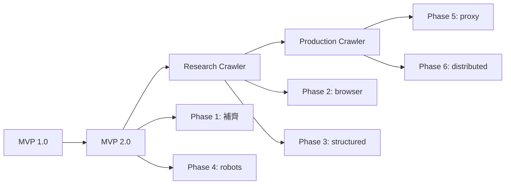

# OpenClaw Web Intelligence Gateway — Roadmap

> 本文件定義專案的長期發展路線圖，分為 MVP 與後續演進階段。

---

## 📍 當前狀態

| 版本 | 狀態 | 日期 |
|------|------|------|
| MVP 1.0 | ✅ 已完成 | 2026-03-10 |
| MVP 2.0 | 🚧 進行中（多個 phase 已有第一版） | 2026-03-11 |

現況總覽請參考 [CURRENT_STATE.md](./CURRENT_STATE.md)。
研究型到 production 的演進策略請參考 [RESEARCH_TO_PRODUCTION_PLAN.md](./RESEARCH_TO_PRODUCTION_PLAN.md)。

---

## 🗺️ 總體規劃

---

## 📦 版本規劃

### MVP 1.0 ✅（當前）

**目標**：基本功能可用

**已完成功能**：
- 🔍 搜尋（DDGS adapter）
- 📄 擷取（HTTP fetch + Cheerio）
- 🗺️ 網站地圖（BFS 探索）
- 🕷️ 爬蟲（探索 + 擷取）
- 💾 快取（JSON 檔案快取）
- 📊 API 規格符合度 95%

**限制**：
- 僅支援靜態 HTML
- 無 robots.txt 解析
- 無 structured extraction
- 單機同步執行

---

### MVP 2.0（下一版本）

**目標**：把現在的 MVP 補到實用等級

**預計時間**：2-3 週

| Phase | 內容 | 優先級 |
|-------|------|--------|
| Phase 1 | 統一 extraction pipeline + 雙層快取 | 🔴 高 |
| Phase 4 | robots.txt 解析與策略 | 🔴 高 |
| Phase 3 | Structured extraction（三層設計） | 🟡 中 |
| Phase 2 | Headless browser fallback | 🟡 中 |

**詳細內容**：

#### Phase 1：統一 extraction pipeline + 雙層快取
- [x] 重構 httpExtractor 與 crawler 共用抽取邏輯
- [x] 實作雙層快取基礎（request cache + page cache）
- [x] 加入 ETag/Last-Modified 支援
- [ ] 加入 per-URL TTL

> 備註：2026-03-11 已完成 Phase 1 第一版骨架，後續可在此基礎上接 browser / structured / robots。

#### Phase 4：robots.txt 解析
- [x] 解析各主機的 robots.txt 政策
- [x] 實作 strict/balanced/off 三種模式
- [x] 在 frontier enqueue 前檢查
- [ ] 補 crawl report / debug metadata 中的 robots decision trace

#### Phase 3：Structured extraction
- [x] 三層設計中的第一版站型 structured extraction 骨架
- [x] Pluggable extractor 架構（article/docs/product/forum 基礎版）
- [x] docs/article coverage 第一輪擴充（JSON-LD article、TOC/section/pathType 等）
- [ ] 強化更多 site-specific extractor 與 schema normalization

#### Phase 2：Headless browser
- [x] Playwright fetcher 第一版
- [x] fetchRouter / routing skeleton
- [x] browser fallback skeleton（router + fetcher + fallback wiring）
- [x] 自動 fallback（static → browser）第一版，已支援 extract / crawl
- [x] heuristics v1.1：JS shell / noscript shell / thin DOM detection
- [ ] host-specific heuristics / retry classification 正式版（持續調優）
- [ ] browser binaries 安裝與運維文件

> 備註：2026-03-11 已完成 Phase 2 第一版，可執行 browser fetch；部署端仍需確保 Playwright Chromium binaries 可用。

---

### Research Crawler（研究型爬蟲）

**目標**：能穩定擷取 docs/blog/article 網站，並提供 agent-ready 輸出。

**預計時間**：4-6 週

| Priority | 能力 | 說明 |
|----------|------|------|
| 1 | Sitemap ingestion | 提升 discover coverage |
| 2 | Retry classification | 系統化 static/browser retry 判斷 |
| 3 | Host policy memory | 讓常見 host 有更穩定 routing |
| 4 | Site-specific structured extraction | 提高 docs/article/changelog 輸出品質 |
| 5 | Browser ops / deployment docs | 降低落地摩擦 |
| 6 | Lightweight per-domain rate limiting | 建立基本治理能力 |

---

### Bridge Layer（從 Research 到 Production 的過渡層）

**目標**：建立最小可治理能力，讓系統能持續執行與被監控。

| Priority | 能力 | 說明 |
|----------|------|------|
| 1 | Monitor scheduling | recurring monitor execution |
| 2 | Alerting abstraction | webhook / Telegram / console 通知 |
| 3 | Persistence baseline | monitor / crawl job state groundwork |
| 4 | Observability baseline | request / crawl / retry metrics |
| 5 | Governance baseline | safer concurrency / rate controls |

---

### Production Crawler（生產型爬蟲）

**目標**：在有真實 operational pressure 後，支援可規模化、可分散式執行。

**預計時間**：8-12 週

| Priority | 能力 | 說明 |
|----------|------|------|
| 1 | Queue / worker abstraction | 任務排隊與 worker lifecycle |
| 2 | Persistent job orchestration | job history / retry / backoff |
| 3 | Proxy strategy | domain-specific outbound policy |
| 4 | Anti-bot policy layer | escalation / fallback / throttling |
| 5 | Distributed crawl | multi-worker frontier coordination |
| 6 | Storage backend upgrade | snapshot / crawl / diff persistence |
| 7 | Production observability | dashboard / thresholds / health checks |

---

## ✅ 優先執行順序

根據目前定位，優先順序應採「先 research quality，後 production complexity」：

| 優先 | 階段 | 理由 |
|------|------|------|
| 1 | Research Crawler | 直接提升 coverage / quality / agent usability |
| 2 | Bridge Layer | 補齊 scheduling / alerting / persistence / observability |
| 3 | Production Crawler | 有明確 operational pressure 再投入 |

---

## 📊 功能對照表

| 功能 | MVP 1.0 | MVP 2.0 | Research | Production |
|------|---------|----------|----------|------------|
| 靜態 HTTP fetch | ✅ | ✅ | ✅ | ✅ |
| Headless browser | ❌ | 🔄 | ✅ | ✅ |
| Structured extraction | ❌ | 🔄 | ✅ | ✅ |
| robots.txt | ❌ | 🔄 | ✅ | ✅ |
| Proxy routing | ❌ | ❌ | 🔄 | ✅ |
| 分散式 | ❌ | ❌ | ❌ | 🔄 |
| Monitor/Diff | ❌ | ✅ v1 | 🔄 | ✅ |

---

## 🔗 相關文件

- [ARCHITECTURE.md](./ARCHITECTURE.md) - 詳細架構說明
- [README.md](./README.md) - 專案說明與快速開始
- [Implementation Plan](./docs/openclaw-web-intelligence-implementation-plan.md) - MVP 2.0 細部規劃
- [API Spec](./docs/openclaw-web-intelligence-api-spec.md) - API 規格
