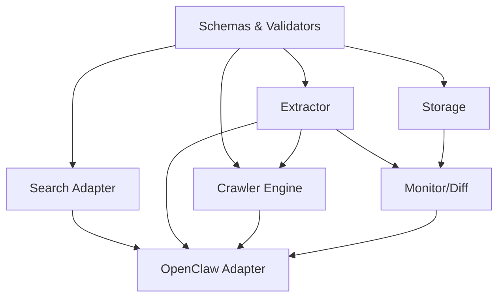

# OpenClaw Web Intelligence Gateway — Implementation Plan

> Goal: turn PRD + SDD + User Stories + API Spec into an executable engineering plan.

---

# 1. Executive Summary

## 1.1 Strategy

建議採用 **分階段實作節奏**：

### MVP 1.0（已完成）
1. schemas / foundations
2. HTTP extract
3. search integration
4. map / crawl
5. storage / cache / observability
6. OpenClaw integration

### MVP 2.0（規劃中）
1. Phase 1: 統一 extraction pipeline + 雙層快取
2. Phase 4: robots.txt 解析
3. Phase 3: Structured extraction
4. Phase 2: Headless browser

### 核心原則
- 先靜態 HTTP path，後 browser path
- 先 contract，後 engine
- 先 bounded crawl，後 advanced scaling
- 先 debugability，後花俏功能

---

# 2. Delivery Scope

## MVP 1.0 Deliverables（已完成）
- unified schemas and validators
- HTTP extractor
- search adapter
- map/crawl engine
- cache
- structured logs
- OpenClaw-facing adapter
- docs + examples

## MVP 2.0 Deliverables（現況更新）
- [x] 統一 extraction pipeline（Phase 1 第一版已落地）
- [x] 雙層快取（request + page，含 conditional revalidation）
- [x] Playwright browser fetcher 第一版（browser fetch 可用；仍需補 binaries/ops 文件）
- [x] robots.txt 解析（strict/balanced/off 第一版已落地於 map/crawl）
- [x] robots decision trace / crawl debug metadata 第一版
- [x] Structured extraction（article/docs/product/forum 基礎版已接入 extract/crawl pipeline）
- [ ] Per-domain rate limiting
- [x] Monitor / Diff 第一版（baseline snapshot + title/text/structured/urlCount diff）

## Deferred
- login session support
- screenshot/download flows
- distributed workers
- multi-provider ranking fusion

---

# 3. Workstreams

## Workstream A — Foundations
**Outputs**
- repo setup
- TypeScript config
- schemas
- validators
- error model

## Workstream B — Retrieval Engines
**Outputs**
- search engine adapter
- HTTP extractor
- crawler engine

## Workstream C — Data & Infra
**Outputs**
- SQLite schema
- artifacts directory management
- cache service
- observability

## Workstream D — OpenClaw Integration
**Outputs**
- adapter interface
- usage docs
- examples
- monitor workflow integration

---

# 4. Week-by-Week Plan

## Week 1 — Foundations + Extract Core

### Objectives
- lock contracts
- create project skeleton
- deliver extract happy path

### Tasks
- [ ] initialize project structure
- [ ] define TypeScript types from API spec
- [ ] implement validators
- [ ] implement error classes and mapper
- [ ] implement request context / trace id plumbing
- [ ] implement HTTP fetch wrapper
- [ ] implement HTML parsing
- [ ] implement markdown normalization
- [ ] implement metadata extraction
- [ ] implement link extraction
- [ ] add unit tests for URL and schema validation

### Exit Criteria
- extract operation works on 5 representative static pages
- response matches v1 schema
- failures return typed errors

## Week 2 — Search + Storage + Cache

### Objectives
- enable search workflows
- persist artifacts and add reuse

### Tasks
- [ ] integrate first search provider
- [ ] normalize search results
- [ ] implement include/exclude domains
- [ ] create SQLite schema
- [ ] persist request logs and page artifacts
- [ ] implement filesystem artifact writer
- [ ] implement cache service
- [ ] add structured logs
- [ ] add metrics for extract/search/cache
- [ ] integration test for search->extract flow

### Exit Criteria
- search works with normalized results
- extract results are stored and cacheable
- logs and metrics show request lifecycle

## Week 3 — Map / Crawl + Safety

### Objectives
- support bounded docs/help-center crawling safely

### Tasks
- [ ] implement frontier queue
- [ ] implement URL normalization / dedupe
- [ ] implement scope evaluator
- [ ] implement map mode
- [ ] implement crawl mode
- [ ] implement crawl report summary
- [ ] implement robots policy evaluator
- [ ] implement domain allowlist / denylist
- [ ] implement log redaction for PII/token-like values
- [ ] add integration tests for docs-site crawling

### Exit Criteria
- can map and crawl bounded scope with limits
- denied URLs fail safely
- crawl report is persisted

## Week 4 — OpenClaw Integration + Monitor/Diff + Hardening

### Objectives
- expose usable MVP to OpenClaw workflows
- add recurring monitoring
- document and stabilize

### Tasks
- [ ] implement OpenClaw-facing adapter methods
- [ ] create examples for research/docs monitoring use cases
- [ ] implement monitor job schema
- [ ] implement baseline snapshot compare
- [ ] implement no-change suppression
- [ ] implement cooldown logic
- [ ] add end-to-end tests for monitor flow
- [ ] write operations documentation
- [ ] performance pass on hot paths
- [ ] release checklist / smoke tests

### Exit Criteria
- OpenClaw adapter can call search/extract/map/crawl
- monitor job can detect meaningful page change
- docs are sufficient for internal use

---

# 5. Dependency Graph

---

# 6. Suggested Task Ordering for Agents / Engineers

## Lane 1 — Contract & Core
- types
- validators
- errors
- request context

## Lane 2 — Extract
- fetch wrapper
- parser
- markdown normalization
- metadata / links

## Lane 3 — Search
- provider adapter
- ranking / dedupe
- search pipeline tests

## Lane 4 — Crawl
- queue
- URL normalization
- scope rules
- crawl report

## Lane 5 — Persistence / Ops
- SQLite
- cache
- logging
- metrics

## Lane 6 — Integration
- OpenClaw adapter
- monitor jobs
- docs/examples

---

# 7. Acceptance Milestones

## Milestone A — Static Retrieval Ready
**Definition**
- extract stable
- schema stable
- basic tests pass

## Milestone B — Research Pipeline Ready
**Definition**
- search + extract end-to-end works
- cache and logs active

## Milestone C — Docs Indexing Ready
**Definition**
- map/crawl bounded docs site
- crawl summary works
- safety controls active

## Milestone D — OpenClaw MVP Ready
**Definition**
- adapter integrated
- monitor/diff basic workflow works
- documentation ready

---

# 8. Risk Register

## Risk 1 — Extract quality too inconsistent
**Mitigation**
- add golden tests for representative sites
- preserve raw artifacts for debugging

## Risk 2 — Crawl complexity expands too quickly
**Mitigation**
- enforce strict MVP limits
- focus on docs/blog/help-center first

## Risk 3 — Schema churn delays implementation
**Mitigation**
- lock API spec before engine expansion
- avoid ad hoc field additions

## Risk 4 — Too much effort spent on browser early
**Mitigation**
- explicitly defer browser executor to post-MVP

## Risk 5 — Monitoring generates noisy alerts
**Mitigation**
- start with hash + field diff
- add cooldown and suppression from day one

---

# 9. Definition of Done (MVP)

A story / module is done only if:

- code implemented
- schema validated
- tests added or updated
- logs/errors observable
- docs updated when interface changed
- no unbounded crawl behavior introduced

---

# 10. Recommended Immediate Next Steps

## Option A — Start coding directly
Use this order:
1. create project skeleton
2. implement schemas and validators
3. implement extractor

## Option B — Delegate via coding agents
Prepare these inputs first:
- PRD
- SDD
- API Spec
- this Implementation Plan
- clear lane assignment per agent

## Option C — Create Jira first
Use `openclaw-web-intelligence-user-stories.md` to generate stories and tasks by epic.

---

# 11. Final Recommendation

如果你要最快進入「可實作」狀態，下一步不是再寫更多概念文件，而是：

1. 建專案骨架
2. 鎖 schema
3. 開始做 extractor

因為 extractor 是整個系統的地基；search、crawl、monitor 最後都會回到 extract output quality。

---

# 12. MVP 2.0 詳細工作拆解

## Phase 1：統一 Extraction Pipeline + 雙層快取

### Objectives
- 統一 httpExtractor 與 crawler 的抽取邏輯
- 實作雙層快取架構

### Tasks
- [ ] 重構 httpExtractor.ts 為通用抽取模組
- [ ] 讓 crawler.ts 共用抽取邏輯
- [ ] 實作 request cache（基於 request hash）
- [x] 實作 page cache（基於 URL + ETag/Last-Modified）
- [ ] 實作 per-URL TTL
- [ ] 實作 stale-while-revalidate

### Exit Criteria
- extract 與 crawl 輸出欄位一致
- 同一 URL 第二次請求從 cache 回應
- 快取命中率可查詢

---

## Phase 4：robots.txt 解析

### Objectives
- 讓爬蟲遵守 robots.txt 政策
- 提供 strict/lenient/off 三種模式

### Tasks
- [ ] 實作 robots.txt 解析器
- [ ] 實作 robotsMode（strict/lenient/off）
- [ ] 在 frontier enqueue 前檢查 robots
- [ ] 解析 /robots.txt 的 Sitemap
- [ ] 快取 robots policy（per-host）

### Exit Criteria
- 可設定 strict 模式，robots 禁止的 URL 不會被抓取
- Lenient 模式會記錄 warning 但仍允許

---

## Phase 3：Structured Extraction

### Objectives
- 三層設計：通用 → 主內容 → 站型
- 輸出結構化資料

### Tasks
- [ ] 實作 Layer 1：通用內容抽取（固定 document model）
- [ ] 實作 Layer 2：主內容辨識（boilerplate removal）
- [ ] 實作 Layer 3：站型專用 extractor
- [ ] 建立 pluggable extractor 架構
- [ ] 支援 kinds：generic、docs、article、product、forum
- [ ] Schema validation

### Exit Criteria
- 每個文件都有 kind 與 structured 欄位
- 可自訂新增站型 extractor

---

## Phase 2：Headless Browser

### Objectives
- 支援 JS-heavy 網站
- 自動 fallback 機制

### Tasks
- [ ] 安裝 Playwright
- [ ] 實作 browserFetcher.ts
- [ ] 實作 fetchRouter.ts 決策邏輯
- [ ] 實作 static → browser fallback
- [ ] 支援 screenshot（debug 用）
- [ ] 設定 UA、viewport、timezone

### Exit Criteria
- 設定 renderMode=browser 時使用 Playwright
- Static fetch 失敗時自動 fallback 到 browser
- JS-heavy 網站可正確擷取內容

---

# 13. MVP 2.0 驗收標準

| Milestone | 定義 |
|-----------|------|
| **MVP 2.0 Ready** | Phase 1 + 4 完成 |
| **Research Crawler Ready** | Phase 2 + 3 完成 |
| **Production Crawler Ready** | Phase 5 + 6 完成 |

---

# 14. 參考文件

詳細架構請參考：
- [ROADMAP.md](./ROADMAP.md)
- [ARCHITECTURE.md](./ARCHITECTURE.md)
