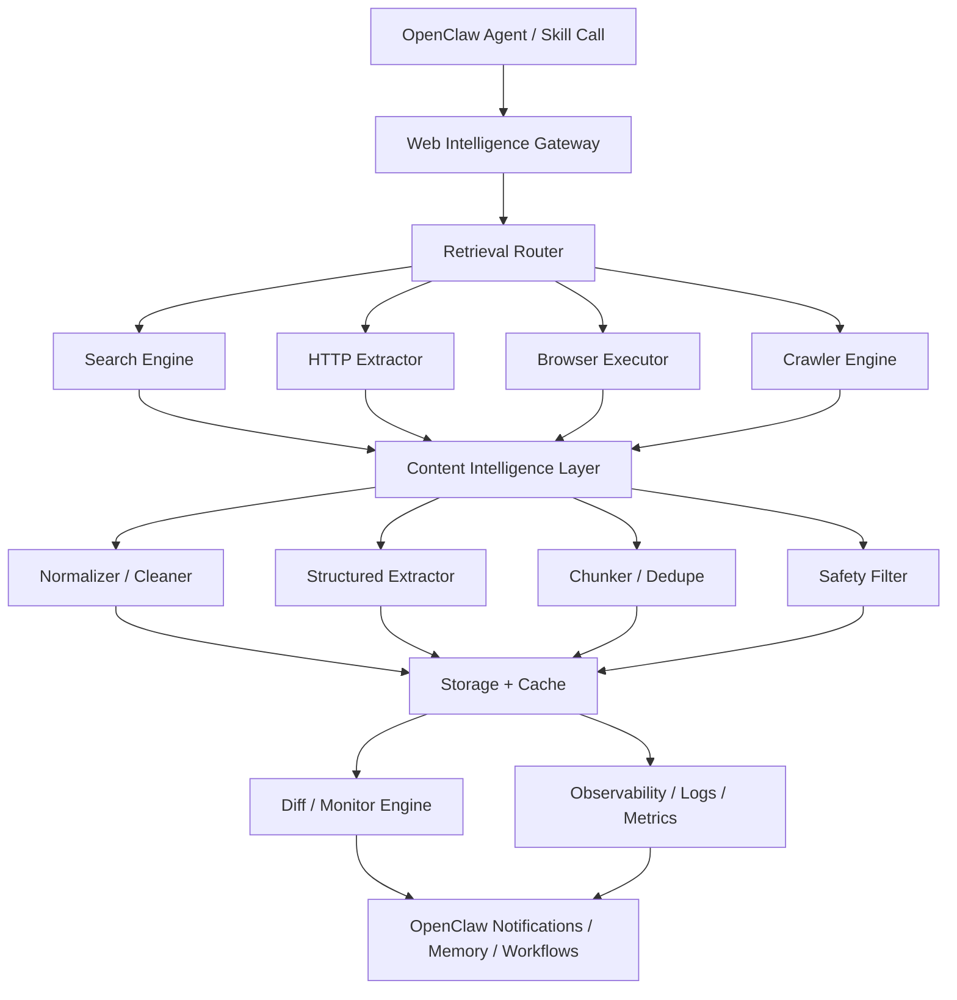
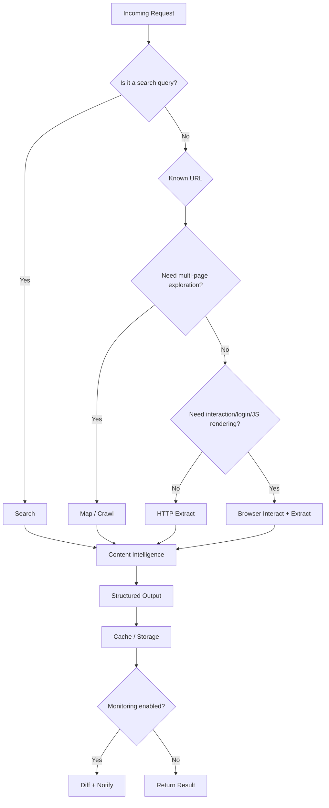

# OpenClaw 強大爬蟲工具 PRD + 架構圖 + MVP 任務拆解

> Project codename: **OpenClaw Web Intelligence Gateway**
> 
> Positioning: 給 OpenClaw agent 使用的統一 Web Data 能力層，整合搜尋、抓取、互動式瀏覽、結構化抽取、快取、監控與安全防護。

---

# 1. Executive Summary

## 1.1 結論

本專案目標不是再做一個單純的 scraper，而是打造一個 **OpenClaw 專用的 Web Intelligence Gateway**，讓 agent 能用一致介面完成：

- 搜尋可信來源
- 抽取單頁內容
- 遞迴 crawl 網站
- map 網站結構
- 在 JS-heavy / login 頁面進行互動式抓取
- 將內容清洗成 LLM-ready markdown / JSON
- 進行排程監控、差異偵測與通知

這個能力層要補上 OpenClaw 在研究、競品分析、文件索引、變更監控、流程自動化上的核心缺口。

## 1.2 產品主張

## 1.2A Current Delivery Status (2026-03-11)

目前已經不是純規劃階段，已落地的交付包括：
- search / extract / map / crawl 基礎能力
- Playwright browser fetcher v1
- auto browser fallback v1（extract / crawl）
- robots policy v1
- structured extraction v1
- conditional cache revalidation

因此本 PRD 仍作為產品方向文件使用，但實際完成度請以 `CURRENT_STATE.md` 與 `ROADMAP.md` 為準。


**一句話版本：**

> Search, crawl, interact, extract, and monitor the web for OpenClaw agents.

**核心價值：**

- 比單純 browser automation 更便宜
- 比單純 scraper 更穩定
- 比 prompt-only workflow 更可重複、可觀測、可維護
- 比純外部 SaaS 更可控、更能與 OpenClaw 深度整合

---

# 2. Product Requirements Document (PRD)

## 2.1 背景與問題

目前 OpenClaw 雖已有：

- `web_fetch`：適合靜態頁 / 一般文章抽取
- `browser`：適合互動式頁面操作
- `summarize`、`browser-use` 等 skill：可補足部分研究流程

但缺少一個 **統一、可重複、可配置、可監控** 的 web intelligence abstraction layer。

### 當前痛點

1. **抓取策略分散**
   - 靜態頁、JS-heavy 頁、搜尋結果、網站 crawl、登入後頁面，各自需要不同流程。

2. **缺乏標準輸出**
   - 抓回來的資料格式不一致，不利 agent 做後續推理、引用、比對與記憶。

3. **缺乏快取與變更監控**
   - 同一頁重複抓取成本高，也缺少網站異動通知能力。

4. **缺乏安全層**
   - prompt injection、PII、惡意來源、robots 規則、登入 session 隔離，都需要系統化處理。

5. **缺乏生產級可觀測性**
   - 無法穩定追蹤錯誤、重試、抽取品質、來源品質、快取命中率。

## 2.2 產品目標

### 核心目標

建立一套給 OpenClaw agent 使用的統一 web data system，支援：

- 搜尋（Search）
- 單頁抽取（Extract）
- 網站探索（Map）
- 網站爬取（Crawl）
- 互動式擷取（Interact）
- 監控與差異偵測（Monitor + Diff）

### 商業 / 使用價值目標

- 讓 OpenClaw 在研究類工作流中，大幅降低人工拼湊工具流程的成本
- 讓市場分析、競品監測、文檔同步、站點索引、資料監控等能力變成可複用基礎設施
- 讓 agent 從「會上網」提升為「有系統地取得可用 web intelligence」

## 2.3 非目標（Non-goals）

MVP 階段**不做**：

- 全面對抗最重度 bot protection 的專業 anti-detection 瀏覽器方案
- 社群平台（如 Facebook / X / Instagram）的大規模專用抓取器
- 完整通用搜尋引擎替代品
- 企業級分散式 browser farm
- 視覺模型驅動的 universal UI agent

## 2.4 目標使用者

### Primary Users

1. **OpenClaw power users / builders**
   - 需要把 web research、crawl、monitoring 整合進 agent workflow

2. **研究 / 分析型 agent workflows**
   - 市場研究
   - 競品分析
   - 文件彙整
   - 主題追蹤

3. **自動化工作流設計者**
   - 需要定期抓網站、比較變化、通知頻道

### Secondary Users

- 需要登入後頁面抓取的後台營運流程
- 需要網站知識庫索引的團隊
- 需要監控網站變更的產品 / 情報分析工作者

## 2.5 核心 Use Cases

### Use Case 1：深度研究
使用者要求 OpenClaw 研究某主題，系統先搜尋來源，再抽取高品質頁面內容，輸出摘要與引用。

### Use Case 2：競品監控
定時 crawl 競品網站指定區域，偵測定價、文案、功能頁變化，僅在異動時通知。

### Use Case 3：文件知識庫索引
對 docs / help center 做 map + crawl，抽出 markdown 與 metadata，建立內部檢索資料源。

### Use Case 4：登入後流程抓取
透過 browser interaction 完成登入、點擊、展開區塊、下載檔案，再抽取結果。

### Use Case 5：網站變更雷達
對特定頁面設定定期抽取，做 diff，比對標題、主文、價格、CTA、表格內容等變化。

## 2.6 功能需求

### F1. Search
系統需支援 web search：

- 輸入 query
- 回傳候選來源
- 包含 title / url / snippet / source type / freshness
- 可設定 include / exclude domains
- 可選擇 general / news / docs-oriented search mode

### F2. Extract
系統需支援單頁抽取：

- 輸入單一或多個 URL
- 回傳 cleaned markdown / text / html
- 包含 metadata（title、description、canonical、published_at、status code 等）
- 可選擇結構化 schema extraction
- 可輸出 screenshot（選配）

### F3. Map
系統需支援站點探索：

- 從 seed URL 探索網站可達頁面
- 回傳 URL list 與層級關係
- 可設最大深度、最大寬度
- 可 include/exclude path pattern

### F4. Crawl
系統需支援網站爬取：

- 從 seed URL crawl 多頁
- 支援 domain 限制、path 限制、深度 / 廣度 / 頁數上限
- 回傳每頁抽取結果與 crawl report
- 自動 dedupe / canonicalize URL

### F5. Interact
系統需支援互動式瀏覽抓取：

- navigate
- click
- type / fill
- wait
- scroll
- press
- screenshot
- download file
- extract after interaction

### F6. Monitor + Diff
系統需支援網站監控：

- 建立監控 job
- 定時重跑
- 和前次結果做 diff
- 設定 change threshold
- 僅在變更時通知 OpenClaw channel / workflow

### F7. Structured Output
系統需有統一輸出 schema，方便 agent 後續推理。

### F8. Cache
系統需支援：

- page cache
- extraction cache
- TTL policy
- cache hit / miss observability

### F9. Safety Guardrails
系統需支援：

- domain allowlist / denylist
- robots policy 模式
- rate limit
- PII redaction
- prompt injection sanitization
- login session isolation

### F10. Observability
系統需支援：

- request logs
- retries
- latency metrics
- extraction quality metrics
- job history
- error taxonomy
- debug artifacts（raw html / screenshot）

## 2.7 非功能需求

### Reliability
- 一般 extract request 成功率應高
- 任務失敗需有明確錯誤分類與可重試機制

### Performance
- 靜態頁 extract：低延遲
- search / map：中低延遲
- browser interaction：允許較高延遲，但需有 timeout 與穩定回退

### Scalability
- 可支援多個並行 crawl job
- crawl / browser jobs 應可佇列化

### Security
- 預設安全：不對任意未知網站無限制 crawl
- 對登入狀態與敏感資訊做隔離

### Maintainability
- 各執行引擎（HTTP / browser / crawler）需模組化
- 所有輸出需版本化 schema

## 2.8 成功指標（Success Metrics）

### Product Metrics
- 研究型任務中，agent 可直接使用的有效來源比例提升
- 使用者手動介入 browser 操作的次數下降
- 網站監控誤報率下降

### System Metrics
- Extract success rate
- Crawl completion rate
- Average latency by mode
- Cache hit rate
- Retry rate
- Diff precision

---

# 3. Information Architecture / API Surface

## 3.1 對外能力介面

建議統一成以下 API / tool surface：

```ts
search(query, options)
extract(urls, options)
map(url, options)
crawl(seed, options)
interact(url, actions, options)
monitor(jobSpec)
```

## 3.2 建議輸出結構

```json
{
  "url": "https://example.com/page",
  "finalUrl": "https://example.com/page",
  "status": 200,
  "contentType": "text/html",
  "title": "Example Page",
  "markdown": "# Example Page\n...",
  "text": "Example Page ...",
  "html": "<!doctype html>...",
  "metadata": {
    "description": "...",
    "canonical": "https://example.com/page",
    "publishedAt": "2026-03-01T10:00:00Z",
    "language": "en"
  },
  "structured": {
    "price": "$19",
    "productName": "Starter Plan"
  },
  "links": [
    "https://example.com/docs",
    "https://example.com/pricing"
  ],
  "screenshot": null,
  "confidence": 0.92,
  "sourceQuality": 0.88,
  "extractedAt": "2026-03-10T06:00:00Z",
  "cache": {
    "hit": false,
    "ttlSeconds": 3600
  }
}
```

---

# 4. 架構設計

## 4.1 高階架構



## 4.2 模組拆解

### 1) Retrieval Router
負責決定任務走哪條路：

- static fetch
- browser interaction
- search-first retrieval
- crawl mode

#### 判斷條件
- 是否為 research query 還是已知 URL
- 頁面是否 JS-heavy
- 是否需要登入
- 是否需要大規模多頁
- 是否只需要網站地圖

### 2) Search Engine
負責來源發現：

- 多搜尋源整合（可先單源，後續擴充）
- domain include / exclude
- freshness / quality ranking
- dedupe search results

### 3) HTTP Extractor
負責快速抽靜態頁：

- fetch HTML / JSON
- readability / main-content extraction
- metadata parsing
- link extraction
- cheap mode / fast mode

### 4) Browser Executor
負責互動式抓取：

- Playwright 為核心
- 支援 actions list
- 支援 login session
- 支援下載、截圖、等待、點擊、填表
- 支援 extract-after-actions

### 5) Crawler Engine
負責多頁探索與抓取：

- frontier queue
- URL normalization
- canonical handling
- scope control
- rate limiting
- crawl report

### 6) Content Intelligence Layer
負責把原始內容變成 LLM-friendly data：

- boilerplate removal
- markdown normalization
- structured extraction
- chunking
- dedupe
- confidence scoring

### 7) Safety Layer
負責安全：

- robots handling policy
- injection pattern stripping
- unsafe prompt content tagging
- PII detection / redaction
- domain policies

### 8) Storage / Cache Layer
儲存：

- raw fetch artifact
- cleaned content
- structured output
- crawl jobs
- monitoring history
- diff snapshots

### 9) Diff / Monitor Engine
負責持續追蹤：

- rerun schedule
- baseline compare
- significant change detection
- alert suppression / cooldown

### 10) OpenClaw Integration Layer
接回 OpenClaw：

- tool / skill interface
- webhook / cron integration
- notify to channels
- save memory summary if needed

## 4.3 決策流程圖



## 4.4 建議技術選型

### 語言 / Runtime
- **TypeScript / Node.js**
- 理由：與 OpenClaw 生態整合最佳

### Browser
- **Playwright**
- 理由：穩定、成熟、對互動式流程支援佳

### HTTP / Parsing
- `fetch` / `undici`
- HTML parser（如 Cheerio）
- readability / content extraction library

### Queue / Jobs
- 初期：in-process queue + persistent job JSON / SQLite
- 後期：Redis / durable job queue

### Storage
- 初期：SQLite + file artifacts
- 後期：Postgres + object storage

### Schema Validation
- TypeBox / Zod

### Logging / Metrics
- structured logs
- basic metrics registry

---

# 5. MVP 範圍定義

## 5.1 MVP 目標

先做 **Firecrawl-lite for OpenClaw**，以支援最常見且高價值的任務：

- research workflow
- docs indexing
- site monitoring
- competitor analysis

## 5.2 MVP In Scope

### 必做能力
- `search(query, options)`
- `extract(urls, options)`
- `map(url, options)`
- `crawl(seed, options)`
- cleaned markdown output
- metadata extraction
- basic structured extraction
- basic cache
- domain policy
- logging + metrics

### 可延後能力
- login flows
- advanced browser actions
- file downloads
- deep anti-bot handling
- distributed crawl workers

## 5.3 MVP Out of Scope

- 通用 full browser sandbox SaaS
- 複雜 session replay
- social media scraping specialization
- enterprise multi-tenant RBAC

---

# 6. MVP 任務拆解

## 6.1 Phase 0 — Scoping / Foundations

### 任務
- [ ] 定義專案名稱、目錄結構、模組邊界
- [ ] 定義 API surface（search / extract / map / crawl）
- [ ] 定義輸入 / 輸出 schema
- [ ] 定義錯誤碼與 error taxonomy
- [ ] 定義 cache model 與 artifact model
- [ ] 定義 domain policy / robots policy

### 產出
- API spec v0
- schema definitions
- architecture decision notes

## 6.2 Phase 1 — Extract MVP

### 任務
- [ ] 建立 HTTP extractor
- [ ] 實作單頁 fetch + HTML parse
- [ ] 實作 main content extraction
- [ ] 實作 markdown normalization
- [ ] 實作 metadata extraction
- [ ] 實作 links extraction
- [ ] 實作 basic structured output
- [ ] 實作 timeout / retry / user-agent policy
- [ ] 實作 extract result schema validation

### 驗收標準
- 對 docs、部落格、landing page 可穩定抽出主文與 metadata
- 結果格式一致
- 失敗有明確錯誤分類

## 6.3 Phase 2 — Search MVP

### 任務
- [ ] 整合第一個 search provider
- [ ] 定義 search result schema
- [ ] 實作 include / exclude domains
- [ ] 實作去重與排序
- [ ] 實作 search + extract pipeline
- [ ] 實作 source quality scoring v1

### 驗收標準
- 對一般研究 query 可回傳可用來源列表
- 能直接串接 extract 形成 research pipeline

## 6.4 Phase 3 — Map / Crawl MVP

### 任務
- [ ] 建立 URL frontier queue
- [ ] 實作 URL normalization
- [ ] 實作 canonical / duplicate handling
- [ ] 實作 map mode（只探索 URL）
- [ ] 實作 crawl mode（探索 + extract）
- [ ] 實作 scope control（domain/path/depth/breadth/limit）
- [ ] 實作 crawl report
- [ ] 實作 robots policy
- [ ] 實作 crawl-level rate limit

### 驗收標準
- 可對 docs site / help center 做站點探索與有限深度 crawl
- 不越界抓到非目標 domain
- 可輸出 crawl summary

## 6.5 Phase 4 — Cache / Storage / Observability

### 任務
- [ ] 建立 SQLite schema
- [ ] 儲存 raw artifact / cleaned output / metadata
- [ ] 實作 cache lookup / TTL
- [ ] 實作 structured logs
- [ ] 實作 metrics（latency / success / cache hit / retry）
- [ ] 建立 debug artifact 保存機制

### 驗收標準
- 相同 URL 重抓時可命中快取
- 能查詢任務紀錄與失敗原因

## 6.6 Phase 5 — OpenClaw Integration

### 任務
- [ ] 包裝成 OpenClaw skill / tool interface
- [ ] 設計 agent-facing usage contract
- [ ] 串接 OpenClaw cron / webhook workflow
- [ ] 支援變更通知輸出格式
- [ ] 文件化使用方式與範例 prompt

### 驗收標準
- OpenClaw agent 可直接呼叫 search / extract / crawl / map
- 可接入排程後定期執行並回報

---

# 7. Post-MVP 路線圖

## Phase 6 — Browser Interaction

### 功能
- Playwright action runner
- click / type / wait / scroll / press
- login session isolation
- screenshot / download / extract-after-actions

### 目標
支援 JS-heavy 頁面、登入流程與後台操作。

## Phase 7 — Monitor + Diff Engine

### 功能
- 監控 job 建立
- baseline snapshot
- semantic diff / field diff
- cooldown suppression
- alert policy

### 目標
把單次抓取進化為持續 intelligence monitoring。

## Phase 8 — Research Intelligence Layer

### 功能
- source clustering
- contradiction detection
- freshness weighting
- query planning
- task-oriented crawl strategy

### 目標
更接近 Tavily research / Firecrawl agent 的高階能力。

---

# 8. 風險與對策

## 8.1 風險：抓取成功率不穩
### 對策
- 導入 retry + fallback
- 區分 static vs browser path
- 保存 debug artifacts

## 8.2 風險：網站異質性太高
### 對策
- 先聚焦 docs / blog / landing page / help center
- 不一開始追求萬站通吃

## 8.3 風險：成本失控
### 對策
- 預設走 HTTP extractor
- 只有必要時才升級到 browser
- 強制 cache + domain control

## 8.4 風險：安全問題
### 對策
- domain allowlist / denylist
- robots policy
- PII redaction
- prompt injection sanitization
- session isolation

## 8.5 風險：OpenClaw 整合過深導致耦合
### 對策
- 核心 gateway 先獨立模組化
- OpenClaw integration layer 保持 adapter 化

---

# 9. 建議目錄結構

```text
projects/
  openclaw-web-intelligence/
    src/
      api/
      router/
      engines/
        search/
        extract/
        crawl/
        browser/
      intelligence/
        normalize/
        structure/
        score/
      safety/
      storage/
      monitor/
      observability/
      integration/
        openclaw/
      types/
    docs/
    tests/
    scripts/
    package.json
```

---

# 10. 建議第一版里程碑（2–4 週）

## Milestone 1
- extract + schema + logs

## Milestone 2
- search + extract pipeline

## Milestone 3
- map + crawl + cache

## Milestone 4
- OpenClaw integration + docs + example workflows

---

# 11. 驗收清單（MVP）

- [ ] 可 search 並回傳候選來源
- [ ] 可 extract 單頁並輸出統一 schema
- [ ] 可 map 網站 URL 結構
- [ ] 可 crawl 指定範圍內頁面
- [ ] 可命中快取並回傳 cache metadata
- [ ] 有基本安全控制（domain policy / robots / rate limit）
- [ ] 有 request logs / latency / retry metrics
- [ ] 可由 OpenClaw agent 直接調用
- [ ] 有最少 3 個實際 workflow 範例

---

# 12. 我對這個產品的具體判斷

如果目標是「給 OpenClaw 一個強大爬蟲工具」，**最強的切法不是先做 browser automation，而是先做統一 retrieval layer + content intelligence layer**。

原因很簡單：

- browser automation 很酷，但太貴、太脆
- 真正高頻需求其實是 search / extract / crawl / monitor
- agent 真正需要的是**乾淨、可信、可比較、可引用**的 web data

所以 MVP 最佳路線是：

> **先做 Firecrawl-lite 的資料層，再逐步補 Tavily-like research intelligence，最後才往 browser sandbox 深挖。**

---

# 13. 參考來源

- Lumadock: Web scraping with OpenClaw  
  https://lumadock.com/tutorials/web-scraping-with-openclaw

- Firecrawl 官方網站  
  https://www.firecrawl.dev/

- Firecrawl 官方文件  
  https://docs.firecrawl.dev

- Tavily 官方網站  
  https://www.tavily.com/

- Tavily 官方文件  
  https://docs.tavily.com

- OpenClaw 官方文件  
  https://docs.openclaw.ai
