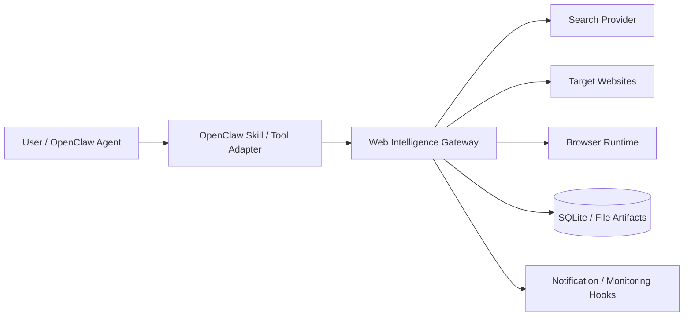
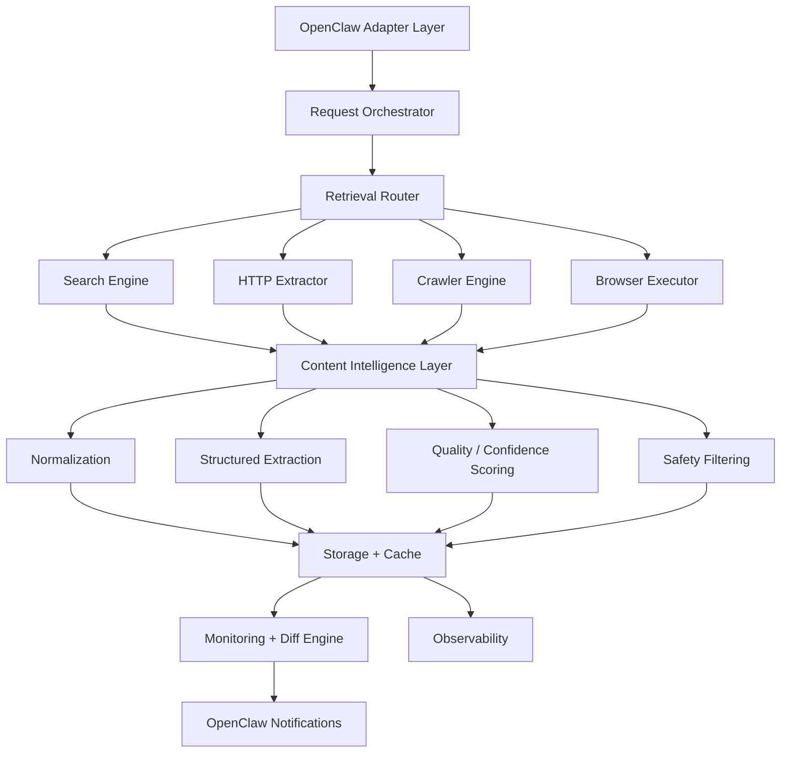
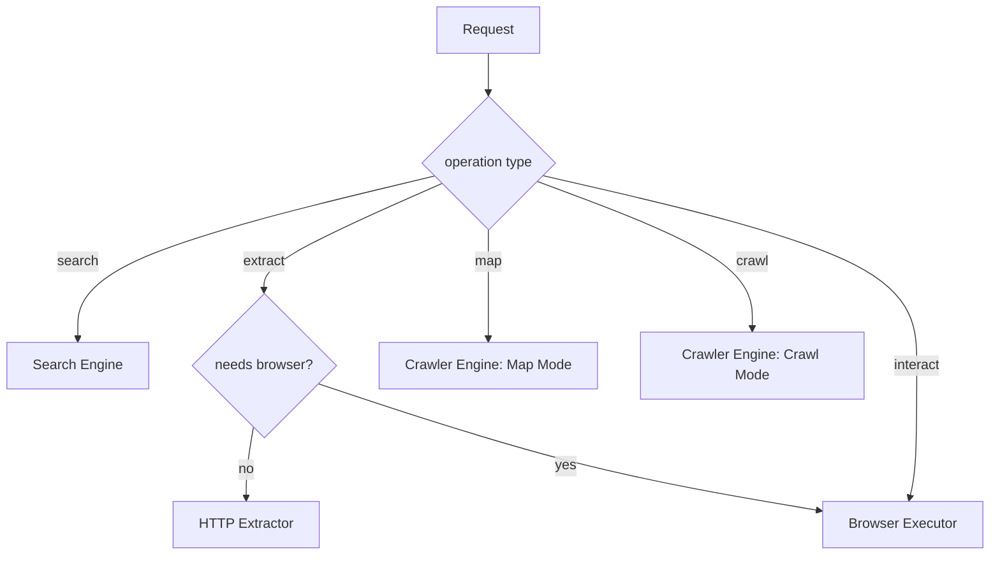
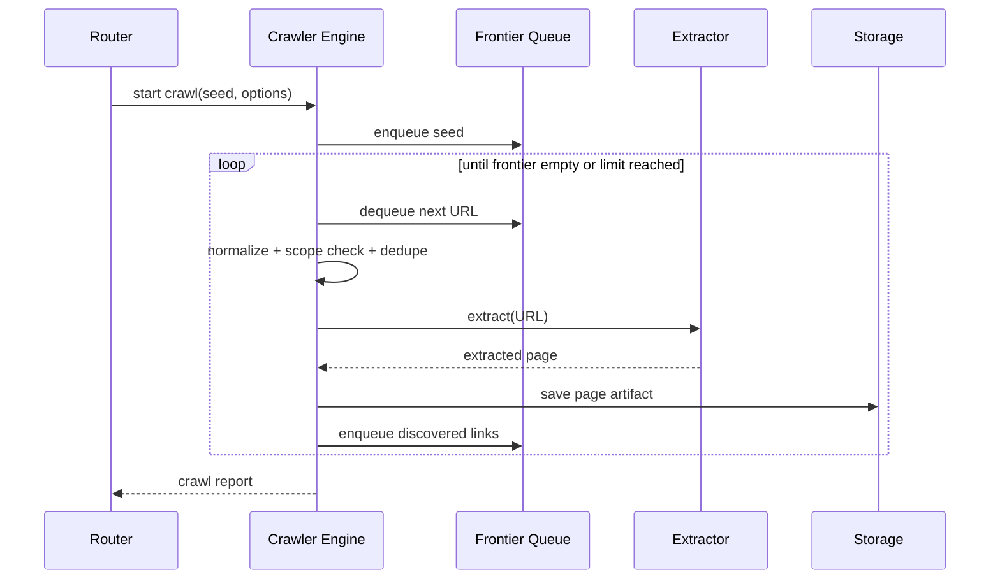
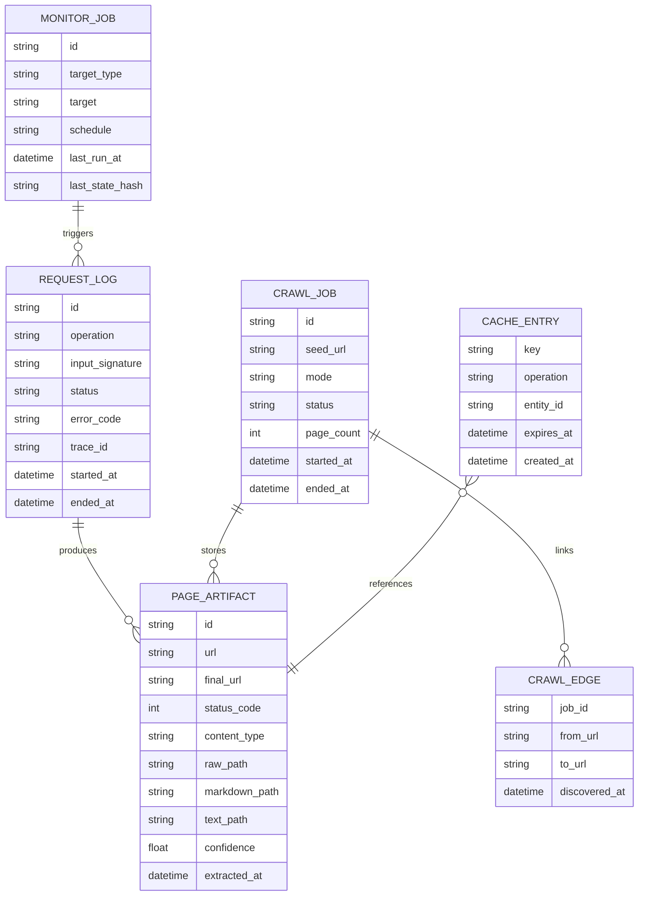
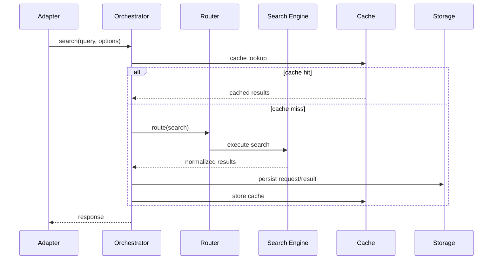
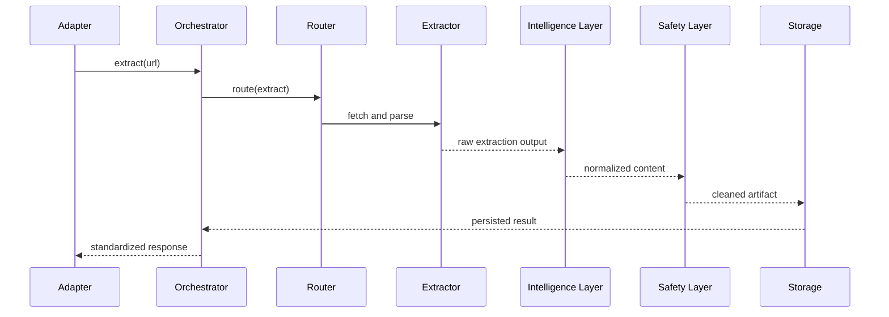

# OpenClaw Web Intelligence Gateway — Software Design Document (SDD)

> Related docs:
> - `openclaw-web-intelligence-prd.md`
> - `openclaw-web-intelligence-user-stories.md`
> - `openclaw-web-intelligence-api-spec.md`
> - `openclaw-web-intelligence-implementation-plan.md`

---

# 1. Executive Summary

## 1.1 Purpose

本文件定義 **OpenClaw Web Intelligence Gateway** 的軟體設計，目標是把搜尋、抽取、crawl、map、互動式瀏覽、快取、監控、差異分析與 OpenClaw 整合，做成一個可實作、可維護、可擴充的系統。

## 1.2 Design Goals

- 統一 web retrieval abstraction
- 先支援 MVP：search / extract / map / crawl
- 讓 browser interaction 能後續平順接入
- 明確切分 storage / cache / monitoring / safety
- 與 OpenClaw skill/tool workflow 保持低耦合整合
- 以 TypeScript / Node.js 為核心

## 1.3 Non-Goals

- MVP 不做大規模分散式 browser farm
- MVP 不做企業級多租戶 RBAC
- MVP 不追求極端 anti-bot 對抗
- MVP 不涵蓋社群平台專用 scraping

---

# 2. System Context

## 2.1 External Context

## 2.2 Responsibilities

### Gateway In Scope
- query routing
- extract orchestration
- crawl orchestration
- content normalization
- structured output generation
- cache / artifacts storage
- monitoring and diff
- observability
- OpenClaw integration adapter

### Out of Scope
- channel delivery itself（交給 OpenClaw）
- LLM reasoning and summarization（交給 agent / summarize flow）
- generic enterprise auth platform

---

# 3. Architecture Overview

## 3.1 High-Level Architecture

## 3.2 Design Principles

- **Router-first**：先判斷 retrieval strategy，再選執行引擎
- **Engine isolation**：search / extract / crawl / browser 不混實作責任
- **Schema-first**：輸出先定義，再實作 engine
- **Artifacts preserved**：保留 raw / cleaned / structured 供 debug 與 diff
- **Progressive enhancement**：先 HTTP path，再擴 browser path
- **Safety by default**：domain policy、robots、rate limit、PII 處理預設啟用

---

# 4. Module Design

## 4.1 OpenClaw Adapter Layer

### Responsibility
- 將 OpenClaw 的 tool / skill 呼叫轉成 gateway request
- 控制輸入驗證、回傳 schema、錯誤映射

### Interfaces
- `search(query, options)`
- `extract(urls, options)`
- `map(url, options)`
- `crawl(seed, options)`
- `monitor(jobSpec)`
- `interact(url, actions, options)`（post-MVP）

### Notes
- Adapter 不直接做抓取邏輯
- Adapter 僅負責 contract、validation、result mapping

## 4.2 Request Orchestrator

### Responsibility
- 建立 request context
- 注入 trace id / request id / job id
- 調用 router
- 聚合 execution result
- 管理 retries / timeout policy

### Core Types
- `RequestContext`
- `ExecutionPlan`
- `ExecutionResult`

## 4.3 Retrieval Router

### Responsibility
決定使用哪種 retrieval path：
- search
- extract
- map
- crawl
- browser

### Inputs
- requested operation
- URL / query
- options
- heuristics（JS-heavy, domain patterns, interaction requirement）

### Decision Rules

### Heuristics v1
- 若明確是 query -> search
- 若是單頁 URL + `renderMode=static` -> HTTP extractor
- 若指定 `requiresInteraction=true` -> browser
- 若指定 `maxDepth > 0` 或 `limit > 1` -> crawl / map
- 若 domain 在 browser-required policy list -> browser

## 4.4 Search Engine

### Responsibility
- 對接 search provider
- result normalization
- ranking / dedupe
- source quality scoring

### Output
- normalized search results array
- optional extract follow-up plan

### Failure Handling
- provider timeout -> retry once
- provider unavailable -> return explicit provider error

## 4.5 HTTP Extractor

### Responsibility
- fetch static content
- parse HTML / text / JSON
- extract main content
- collect metadata and links

### Pipeline
1. HTTP request
2. response validation
3. content-type classification
4. parser selection
5. content extraction
6. markdown normalization
7. metadata extraction
8. safety filter pass

### Failure Cases
- DNS failure
- timeout
- 4xx / 5xx
- empty content
- parse failure

## 4.6 Browser Executor

### Responsibility
- 執行互動式瀏覽流程
- 支援 navigate / click / type / wait / screenshot / extract-after-actions

### MVP Status
- Not implemented in MVP core
- SDD 保留介面與擴充點

### Post-MVP Design
- Playwright based
- isolated browser context per session / job
- artifact capture on failure

## 4.7 Crawler Engine

### Responsibility
- 管理 frontier queue
- URL normalization
- scope control
- crawl / map execution

### Modes
- **Map mode**：探索 URL，不做全文 extract
- **Crawl mode**：探索並對符合規則的頁面 extract

### Internal Components
- frontier queue
- visited set
- scope evaluator
- URL canonicalizer
- robots evaluator
- rate limiter
- crawl reporter

### Crawl Flow

## 4.8 Content Intelligence Layer

### Responsibility
將原始輸出轉成可供 agent 使用的標準資料：
- cleaned markdown
- extracted text
- structured fields
- links
- confidence score

### Submodules
- `normalize/markdown`
- `normalize/text`
- `structure/extract`
- `score/confidence`
- `score/sourceQuality`

### Confidence Scoring v1 Inputs
- content length sanity
- title presence
- metadata completeness
- main-content ratio
- extraction errors count

## 4.9 Safety Layer

### Responsibility
- domain allow / deny enforcement
- robots policy evaluation
- suspicious prompt-like fragment tagging
- PII detection / masking
- unsafe content annotations

### Policy Modes
- `strict`
- `balanced`
- `off`（internal testing only）

## 4.10 Storage + Cache Layer

### Responsibility
- save request logs
- save raw artifacts
- save cleaned output
- save crawl jobs / monitor jobs
- serve cached results

### Persistence Strategy
- SQLite for metadata / job state
- filesystem for artifacts（raw HTML, screenshots, downloaded files）

### Cache Strategy v1
- key = normalized request signature
- separate cache buckets:
  - search cache
  - extract cache
  - map cache
  - crawl summary cache

## 4.11 Monitoring + Diff Engine

### Responsibility
- schedule reruns
- compare current vs baseline
- decide whether to notify

### Diff Types
- raw content hash diff
- markdown diff
- field-level diff
- significant-change heuristics

### Alert Suppression
- cooldown window
- same-change dedupe
- threshold-based notify

## 4.12 Observability Layer

### Responsibility
- structured logs
- latency metrics
- success/failure metrics
- retry counters
- cache hit rate
- job lifecycle events

---

# 5. Data Design

## 5.1 Core Entities

### RequestLog
- id
- operation
- input signature
- startedAt
- endedAt
- status
- errorCode
- traceId

### PageArtifact
- id
- url
- finalUrl
- statusCode
- contentType
- rawPath
- markdownPath
- textPath
- metadataJson
- structuredJson
- confidence
- extractedAt

### CrawlJob
- id
- seedUrl
- mode
- status
- optionsJson
- pageCount
- startedAt
- endedAt

### CrawlEdge
- fromUrl
- toUrl
- discoveredAt
- jobId

### MonitorJob
- id
- targetType
- target
- schedule
- diffPolicyJson
- notifyPolicyJson
- lastRunAt
- lastStateHash

### CacheEntry
- key
- operation
- entityId
- expiresAt
- createdAt

## 5.2 Suggested SQLite Tables

---

# 6. Sequence Flows

## 6.1 Search Flow

## 6.2 Extract Flow

## 6.3 Crawl Flow

See Section 4.7 sequence; implementation uses breadth-first frontier in MVP.

---

# 7. Error Model

## 7.1 Error Categories

- `VALIDATION_ERROR`
- `DOMAIN_POLICY_DENIED`
- `ROBOTS_POLICY_DENIED`
- `SEARCH_PROVIDER_ERROR`
- `FETCH_TIMEOUT`
- `FETCH_HTTP_ERROR`
- `PARSE_ERROR`
- `EXTRACTION_EMPTY_CONTENT`
- `CRAWL_SCOPE_EXCEEDED`
- `RATE_LIMITED`
- `CACHE_UNAVAILABLE`
- `STORAGE_ERROR`
- `INTERNAL_ERROR`

## 7.2 Retry Policy

### Retryable
- network timeout
- temporary DNS issue
- provider 5xx
- transient storage lock

### Non-Retryable
- validation error
- domain deny
- robots deny
- 404
- parse unsupported

### Default Policy
- retry max: 2
- backoff: exponential, capped
- browser path retry: 1

---

# 8. Security Design

## 8.1 Domain Policy
- allowlist mode for sensitive deployments
- denylist for known bad / unwanted domains
- per-job override only for trusted operator

## 8.2 Robots Policy
- default `balanced`
- honor `robots.txt` in crawl mode
- extract single page may allow configurable override

## 8.3 PII Handling
- detect emails / phone / tokens / secrets-like patterns
- redact in logs by default
- retain raw artifact only in protected local storage

## 8.4 Prompt Injection Mitigation
- strip or annotate prompt-like web content when returning to agent
- mark external content as untrusted in metadata

## 8.5 Session Isolation
- browser sessions isolated by job / profile
- login cookies not shared between unrelated jobs

---

# 9. Performance & Scalability

## 9.1 MVP Expectations
- extract: optimized for low-latency static page retrieval
- map/crawl: bounded by configured limits
- monitoring: moderate volume, not high-frequency global crawl

## 9.2 Scaling Path
- move cache metadata from SQLite to Redis if needed
- move artifacts to object storage
- split browser workers from HTTP workers
- add queue-based job execution

---

# 10. Testing Strategy

## 10.1 Unit Tests
- URL normalization
- scope evaluator
- cache key generation
- markdown normalization
- diff significance calculator

## 10.2 Integration Tests
- extract from static pages
- map docs site
- crawl limited site tree
- cache hit/miss behavior
- monitor diff flow

## 10.3 Golden Tests
- expected extraction output snapshots for known pages
- stable schema regression tests

## 10.4 Failure Tests
- timeout
- robots denied
- invalid URL
- parse failure
- storage lock contention

---

# 11. Deployment Design

## 11.1 Runtime
- Node.js service or library module
- initially embedded / co-located in OpenClaw project workspace

## 11.2 Environment
- local dev
- self-hosted VPS
- future split worker mode

## 11.3 Configuration Areas
- search provider keys
- cache TTLs
- crawl limits
- rate limits
- storage paths
- safety policy mode

---

# 12. Open Questions

- search provider abstraction should support multi-provider in v1 or v2?
- should extract cache key include safety mode?
- should monitor diff use semantic similarity in MVP or post-MVP?
- should browser executor be integrated in same process or separate worker?
- how deeply should OpenClaw memory integration be coupled?

---

# 13. Final Recommendation

先實作順序建議：

1. schemas + error model
2. HTTP extractor
3. search adapter
4. map/crawl engine
5. storage + cache
6. observability
7. OpenClaw adapter
8. monitor + diff
9. browser executor

這個順序能最大化早期交付價值，同時避免一開始就被 browser complexity 拖垮。
